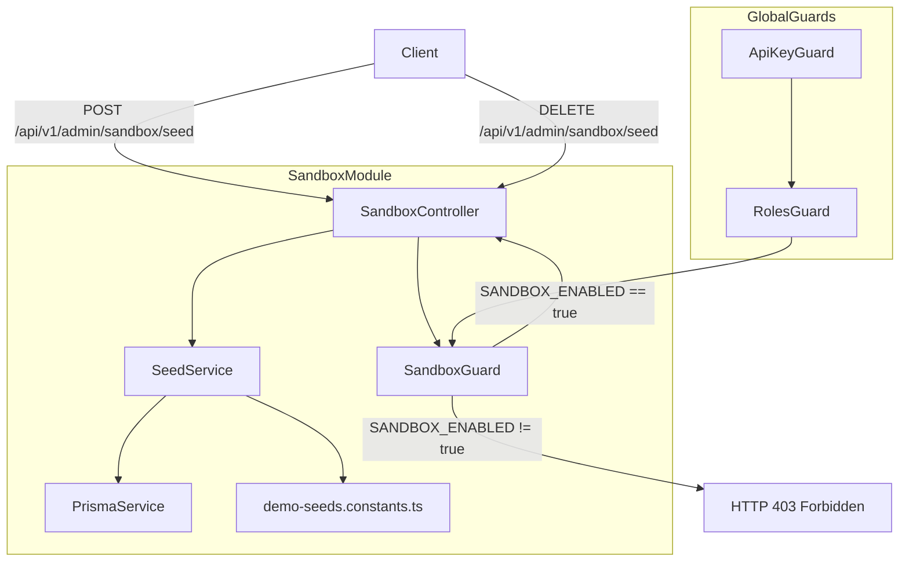

# Design Document: Seeded Demo Tenant and Sandbox Admin Endpoints

## Overview

This feature adds a protected sandbox subsystem to the NestJS backend that lets contributors and reviewers
bootstrap realistic demo data with a single HTTP call. It introduces:

- A `SandboxGuard` that gates all sandbox endpoints behind the `SANDBOX_ENABLED=true` environment variable.
- A `SandboxController` mounted at `admin/sandbox` that exposes seed and reset endpoints.
- A `SeedService` that orchestrates creation and deletion of demo organizations, campaigns, and claims.
- A `demo-seeds.constants.ts` file that holds all typed seed shapes as exported constants.

The feature is additive and isolated: it registers as its own NestJS module (`SandboxModule`) and is
imported into `AppModule` only when the module is present. All sandbox code paths are clearly separated
from production code.

---

## Architecture



### Guard Execution Order

The existing global guards (`ApiKeyGuard` → `RolesGuard`) run first on every request. The `SandboxGuard`
is applied at the controller level via `@UseGuards(SandboxGuard)` and runs after authentication and role
checks have already passed. This means:

1. `ApiKeyGuard` authenticates the caller and sets `request.user`.
2. `RolesGuard` enforces `@Roles(AppRole.admin)` on the controller.
3. `SandboxGuard` checks `SANDBOX_ENABLED` and rejects with 403 if not set to `"true"`.

---

## Components and Interfaces

### SandboxGuard

```
src/sandbox/sandbox.guard.ts
```

A NestJS `CanActivate` guard that reads `process.env.SANDBOX_ENABLED` on every invocation. Returns `true`
only when the value is exactly `"true"`. Otherwise throws `ForbiddenException`.

It does **not** use `ConfigService` injection so it can be applied as a simple class-level guard without
circular dependency concerns. Reading directly from `process.env` is intentional and acceptable for a
feature-flag guard.

### SandboxController

```
src/sandbox/sandbox.controller.ts
```

Mounted at `admin/sandbox` with `@Controller({ path: 'admin/sandbox', version: '1' })`.

| Method   | Path              | Description                                          |
| -------- | ----------------- | ---------------------------------------------------- |
| `POST`   | `/seed/tenant`    | Seed the demo tenant                                 |
| `POST`   | `/seed/campaigns` | Seed demo campaigns                                  |
| `POST`   | `/seed/claims`    | Seed demo claims                                     |
| `POST`   | `/seed`           | Full orchestrated seed (tenant → campaigns → claims) |
| `DELETE` | `/seed`           | Reset (delete) all seeded demo data                  |

All endpoints carry `@Roles(AppRole.admin)` and `@UseGuards(SandboxGuard)`.

### SeedService

```
src/sandbox/seed.service.ts
```

Responsible for all database interactions. Depends only on `PrismaService`.

Key methods:

| Method            | Returns                                                                       |
| ----------------- | ----------------------------------------------------------------------------- |
| `seedTenant()`    | `{ ngoId, created: boolean }`                                                 |
| `seedCampaigns()` | `{ created: number, skipped: number, campaignIds: string[] }`                 |
| `seedClaims()`    | `{ created: number, skipped: number, claimIds: string[] }`                    |
| `seedAll()`       | `{ tenant, campaigns, claims }`                                               |
| `resetSeed()`     | `{ deletedClaims: number, deletedCampaigns: number, deletedTenants: number }` |

### demo-seeds.constants.ts

```
src/sandbox/demo-seeds.constants.ts
```

Exports three typed constants:

- `DEMO_TENANT_SEED` — a single `DemoTenantSeed` object with a fixed deterministic `ngoId`.
- `DEMO_CAMPAIGN_SEEDS` — an array of `DemoCampaignSeed` objects (≥4 entries, one per `CampaignStatus`).
- `DEMO_CLAIM_SEEDS` — an array of `DemoClaimSeed` objects (≥3 entries, one per relevant `ClaimStatus`).

Campaign seeds reference `DEMO_TENANT_SEED.ngoId` by name. Claim seeds reference campaign names from
`DEMO_CAMPAIGN_SEEDS` by name rather than hardcoded strings.

### SandboxModule

```
src/sandbox/sandbox.module.ts
```

```typescript
@Module({
  imports: [PrismaModule],
  controllers: [SandboxController],
  providers: [SeedService, SandboxGuard],
})
export class SandboxModule {}
```

Imported into `AppModule` alongside the other feature modules.

---

## Data Models

No new Prisma models are required. The seed service operates on existing models:

### Existing Models Used

**Campaign** (existing)

- `id` — cuid, primary key
- `name` — string, used as idempotency key alongside `ngoId`
- `status` — `CampaignStatus` enum (`draft | active | paused | completed | archived`)
- `budget` — float
- `metadata` — JSON (used to store `region`, `partner` keys per requirement 4.5)
- `ngoId` — string, links campaign to the demo tenant

**Claim** (existing)

- `id` — cuid, primary key
- `campaignId` — foreign key to Campaign
- `recipientRef` — string, used as idempotency key alongside `campaignId`
- `status` — `ClaimStatus` enum (`requested | verified | approved | disbursed | archived | cancelled`)
- `amount` — float
- `evidenceRef` — optional string (used on at least one seed entry per requirement 5.6)

**Note on `ngoId` / Organization**: The schema does not have a separate `Organization` or `Ngo` model —
`ngoId` is a plain string field on `Campaign` and `ApiKey`. The "demo tenant" is therefore represented
by a well-known fixed `ngoId` string (`"demo-ngo-seed-001"`), not a separate database record. The
`seedTenant` endpoint creates a sentinel `Campaign` record tagged with this `ngoId` to confirm the
tenant context exists, or simply returns the fixed `ngoId` if campaigns already exist for it.

**Revised approach**: `seedTenant` does not create a separate model. It upserts a well-known marker
campaign (status `draft`, name `__demo_tenant_marker__`) under the fixed `ngoId`. This gives a
concrete database artifact that `resetSeed` can target, while keeping the schema unchanged.

### Seed Shape Types

```typescript
// Defined in demo-seeds.constants.ts

interface DemoTenantSeed {
  ngoId: string;
  name: string;
  description: string;
  region: string;
}

interface DemoCampaignSeed {
  name: string;
  status: CampaignStatus;
  budget: number;
  metadata: { region: string; partner: string; [key: string]: unknown };
}

interface DemoClaimSeed {
  campaignName: string; // references DEMO_CAMPAIGN_SEEDS[n].name
  recipientRef: string;
  amount: number;
  status: ClaimStatus;
  evidenceRef?: string;
}
```

### Idempotency Keys

| Entity        | Idempotency Key                                                            |
| ------------- | -------------------------------------------------------------------------- |
| Tenant marker | `ngoId` = `DEMO_TENANT_SEED.ngoId` AND `name` = `"__demo_tenant_marker__"` |
| Campaign      | `name` + `ngoId`                                                           |
| Claim         | `recipientRef` + `campaignId`                                              |

---

## Correctness Properties

_A property is a characteristic or behavior that should hold true across all valid executions of a
system — essentially, a formal statement about what the system should do. Properties serve as the bridge
between human-readable specifications and machine-verifiable correctness guarantees._

### Property 1: SandboxGuard blocks all non-"true" SANDBOX_ENABLED values

_For any_ value of `SANDBOX_ENABLED` that is not exactly the string `"true"` — including `undefined`,
`"false"`, `"1"`, `"TRUE"`, empty string, or any arbitrary string — the `SandboxGuard` SHALL throw
`ForbiddenException` and deny the request.

Reasoning: Requirements 1.2 and 1.5 both describe rejection behavior for different invalid inputs.
They are unified into one property over the full space of non-`"true"` values, naturally expressible
as a property-based test using a filtered string generator plus the `undefined` case.

**Validates: Requirements 1.1, 1.2, 1.5**

### Property 2: Tenant seed idempotency

_For any_ integer N ≥ 1, calling `seedTenant()` exactly N times SHALL result in exactly one tenant
marker record in the database, and all calls after the first SHALL return `{ created: false }`.

Reasoning: Requirements 3.3, 3.4, and 3.5 together describe idempotent upsert behavior. A single
property over N repetitions covers all three: the first call creates (3.4), subsequent calls skip
(3.3, 3.5), and the final count is always 1.

**Validates: Requirements 3.3, 3.4, 3.5**

### Property 3: Campaign seed idempotency

_For any_ integer N ≥ 1, calling `seedCampaigns()` exactly N times SHALL result in exactly
`|DEMO_CAMPAIGN_SEEDS|` campaign records in the database (matched by `name` + `ngoId`), and all calls
after the first SHALL return `skipped` equal to `|DEMO_CAMPAIGN_SEEDS|` and `created` equal to 0.

Reasoning: Requirement 4.3 describes the skip behavior; requirement 4.4 describes the response shape.
Both are captured here since the response counts must reflect the actual database state.

**Validates: Requirements 4.3, 4.4**

### Property 4: Claim seed idempotency

_For any_ integer N ≥ 1, calling `seedClaims()` exactly N times (given all campaigns exist) SHALL result
in exactly `|DEMO_CLAIM_SEEDS|` claim records in the database (matched by `recipientRef` + `campaignId`),
and all calls after the first SHALL return `skipped` equal to `|DEMO_CLAIM_SEEDS|` and `created` equal
to 0.

Reasoning: Same pattern as Property 3, applied to claims.

**Validates: Requirements 5.4, 5.5**

### Property 5: Full seed response shape

_For any_ successful call to `seedAll()`, the response SHALL contain non-null `tenant`, `campaigns`, and
`claims` keys, each with the structure returned by their respective individual seed methods.

Reasoning: Requirement 6.3 specifies the combined response shape. This is a universal property of every
successful `seedAll()` invocation.

**Validates: Requirements 6.3**

### Property 6: Full seed idempotency

_For any_ integer N ≥ 1, calling `seedAll()` exactly N times SHALL produce the same final database state
as calling it once — the total count of seeded records SHALL not grow beyond the first call.

Reasoning: Requirement 6.4 explicitly requires idempotency of the full seed. This subsumes Properties
2–4 at the integration level but is kept as a separate property because it tests the orchestration layer.

**Validates: Requirements 6.4**

### Property 7: Reset preserves non-seeded records

_For any_ database state containing both seeded demo records and non-seeded records (campaigns or claims
with different `ngoId` / `recipientRef` values), calling `resetSeed()` SHALL delete all seeded records
and SHALL leave all non-seeded records intact.

Reasoning: Requirement 7.4 is a preservation property. It must hold for any combination of seeded and
non-seeded data, making it a natural property-based test where non-seeded records are generated randomly.

**Validates: Requirements 7.1, 7.4**

---

## Error Handling

| Scenario                                     | HTTP Status               | Behavior                                                                                                           |
| -------------------------------------------- | ------------------------- | ------------------------------------------------------------------------------------------------------------------ |
| `SANDBOX_ENABLED` not `"true"`               | 403 Forbidden             | `SandboxGuard` throws `ForbiddenException`                                                                         |
| Non-admin API key                            | 403 Forbidden             | Global `RolesGuard` throws `ForbiddenException`                                                                    |
| Missing API key                              | 401 Unauthorized          | Global `ApiKeyGuard` throws `UnauthorizedException`                                                                |
| `seedClaims()` called before campaigns exist | 422 Unprocessable Entity  | `SeedService` throws `UnprocessableEntityException` with message identifying the missing campaign name             |
| Any step in `seedAll()` throws               | 500 Internal Server Error | Controller catches the error, wraps it with the failing step name, and re-throws as `InternalServerErrorException` |
| `resetSeed()` with no seeded records         | 200 OK                    | Returns `{ deletedClaims: 0, deletedCampaigns: 0, deletedTenants: 0 }`                                             |

---

## Testing Strategy

### Dual Testing Approach

Both unit tests and property-based tests are required for comprehensive coverage.

**Unit tests** cover:

- `SandboxGuard` with specific env var values (`undefined`, `"false"`, `"true"`, `"TRUE"`)
- `SeedService` method contracts with a mocked `PrismaService` (using `jest-mock-extended`)
- `SandboxController` endpoint wiring (request → service call → response shape)
- Error path: `seedClaims()` when campaign is missing returns 422
- Error path: `seedAll()` propagates step failure as 500

**Property-based tests** cover the correctness properties above. The project uses Jest as its test runner.
Since no property-based testing library is currently installed, **`fast-check`** is the recommended
addition — it integrates cleanly with Jest and TypeScript.

Install:

```bash
npm install --save-dev fast-check
```

**Property test configuration**:

- Minimum 100 runs per property (`{ numRuns: 100 }`)
- Each test is tagged with a comment referencing the design property

**Tag format**: `// Feature: seeded-demo-tenant-sandbox, Property {N}: {property_text}`

#### Property Test Sketches

```typescript
// Feature: seeded-demo-tenant-sandbox, Property 1: SandboxGuard blocks all non-"true" SANDBOX_ENABLED values
it('rejects any SANDBOX_ENABLED value that is not "true"', () => {
  fc.assert(
    fc.property(
      fc.oneof(
        fc.constant(undefined),
        fc.string().filter(s => s !== 'true'),
      ),
      value => {
        process.env.SANDBOX_ENABLED = value as string;
        const guard = new SandboxGuard();
        expect(() => guard.canActivate(mockContext)).toThrow(
          ForbiddenException,
        );
      },
    ),
    { numRuns: 100 },
  );
});

// Feature: seeded-demo-tenant-sandbox, Property 2: Tenant seed idempotency
it('seedTenant called N times produces exactly one marker record', async () => {
  await fc.assert(
    fc.asyncProperty(fc.integer({ min: 1, max: 10 }), async n => {
      await resetDb();
      for (let i = 0; i < n; i++) await seedService.seedTenant();
      const count = await prisma.campaign.count({
        where: { name: '__demo_tenant_marker__' },
      });
      expect(count).toBe(1);
    }),
    { numRuns: 100 },
  );
});

// Feature: seeded-demo-tenant-sandbox, Property 7: Reset preserves non-seeded records
it('resetSeed does not delete non-seeded campaigns', async () => {
  await fc.assert(
    fc.asyncProperty(
      fc.array(
        fc.record({
          name: fc.string({ minLength: 1 }),
          budget: fc.float({ min: 1 }),
        }),
        { minLength: 1 },
      ),
      async nonSeededCampaigns => {
        await resetDb();
        // Insert non-seeded campaigns
        for (const c of nonSeededCampaigns) {
          await prisma.campaign.create({
            data: { name: c.name, budget: c.budget, ngoId: 'non-seeded-org' },
          });
        }
        await seedService.seedAll();
        await seedService.resetSeed();
        const remaining = await prisma.campaign.count({
          where: { ngoId: 'non-seeded-org' },
        });
        expect(remaining).toBe(nonSeededCampaigns.length);
      },
    ),
    { numRuns: 100 },
  );
});
```

#### Unit Test Coverage Targets

| File                         | Tests                                                                                                                 |
| ---------------------------- | --------------------------------------------------------------------------------------------------------------------- |
| `sandbox.guard.spec.ts`      | `SANDBOX_ENABLED=undefined` → 403, `="false"` → 403, `="true"` → pass                                                 |
| `seed.service.spec.ts`       | `seedTenant` creates then skips, `seedCampaigns` idempotency, `seedClaims` missing campaign → 422, `resetSeed` counts |
| `sandbox.controller.spec.ts` | Each endpoint delegates to service, `seedAll` failure wraps as 500                                                    |
